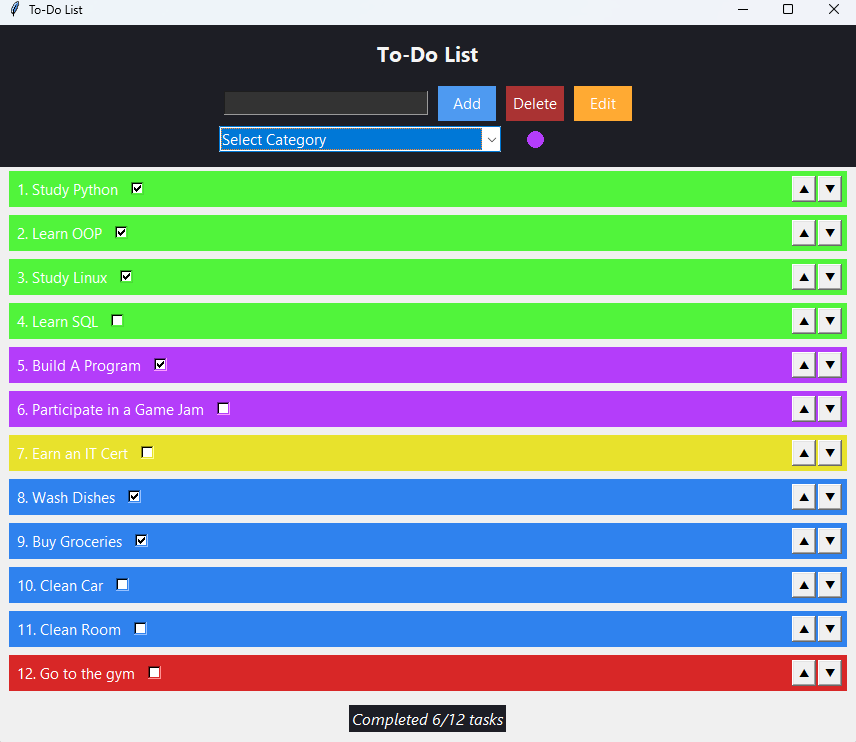

# ✅ Tkinter To-Do List App

A modern, category-based to-do list app built with Python and Tkinter. Clean UI, live progress tracking, editing, and drag-free reordering with arrow buttons. Packaged as a standalone `.exe` for Windows.



---

## 🖥️ Features

- Add tasks with categories (color-coded)
- Mark tasks complete/incomplete
- Edit task names and categories
- Reorder tasks with up/down buttons
- Track completion stats
- Save/load from `tasks.json`
- Simple, dark-themed interface
- Runs as standalone `.exe` — no Python install needed

---

## 🚀 Download

🖥️ **[Download the Windows .exe](https://github.com/saadiqhorton/to-do-app/releases)**

> The `.exe` is bundled in the `dist/` folder or under Releases.

1. **Double-click the `.exe`** file to launch the app.
2. No Python or installation needed.
3. `tasks.json` will be created automatically in the same folder to save your list.

> ⚠️ You might see a Windows SmartScreen warning the first time — click **More info → Run anyway** (it’s normal for unsigned apps).

---

### 💻 If you're running the source code:

1. ```bash
    git clone https://github.com/saadiqhorton/to-do-app/releases/latest
2. ```bash
   cd to-do-app
3. ```bash
   python main.py
